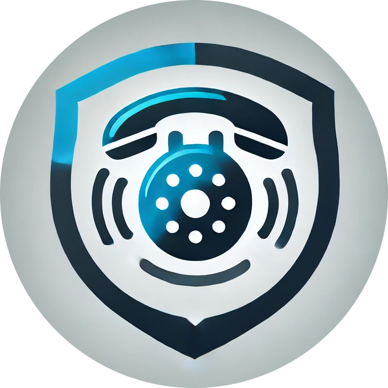

# ClearCall

<i>https://clearcall.netlify.app/</i>

Real-time in-browser voice monitoring and protection.

Protects you and your loved ones by monitoring your calls when you opt in, and uses state-of-the-art AI models to warn you if it detects a phishing attempt. Moreover, ClearCall runs completely offline after the models are initially loaded in the browser cache, which guarantees availability in even remote locations. This ensures that your privacy is maintained, and your data is never transmitted over the internet, providing an extra layer of security.

Technologies:
- ReactJS
- TailwindCSS
- Wasm/Web GPU
- OpenAI API
- Mongo DB

# Run locally
1. Clone the repo  
`git clone https://github.com/meenbeese/ClearCall.git`
2. Install dependencies  
`npm install`
3. Build for dev  
`npm build dev`
4. Navigate to URL  
`http://localhost:5173/`
